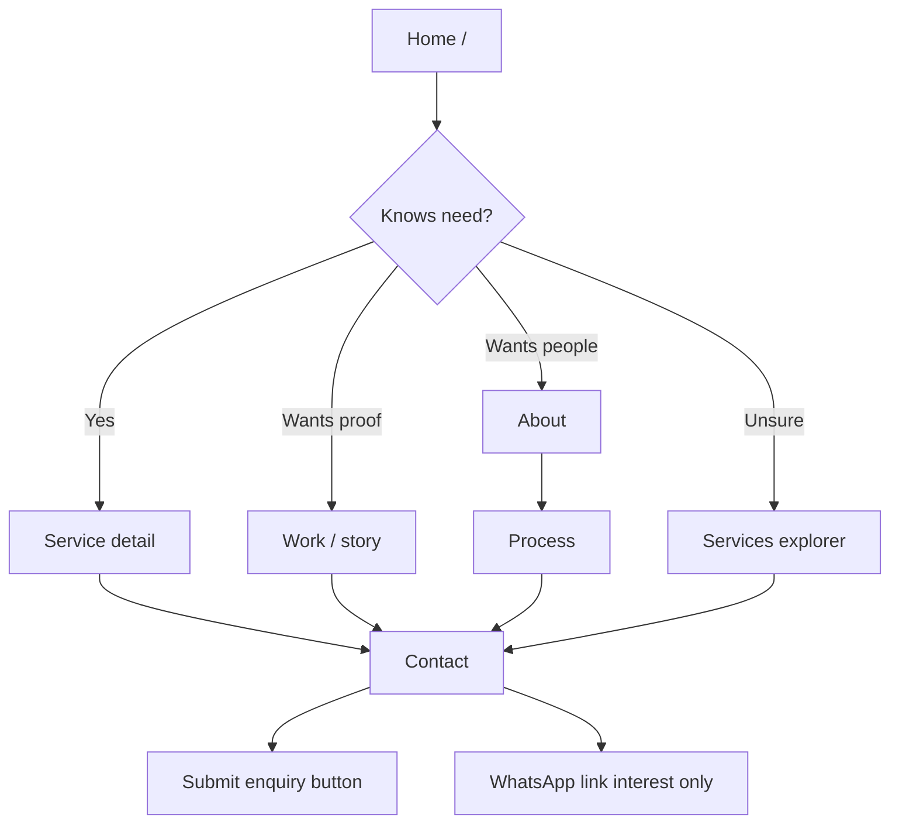

# Visitor journeys

**Status:** Planning only — no pages or analytics implemented yet  
**Created:** 16 September 2026  
**Related:** `docs/planning/03-sitemap.md`, `docs/planning/navigation-spec.md`

Every journey ends with a useful next action. Primary conversion is a stored enquiry on Contact. Secondary interest paths (WhatsApp) are not counted as confirmed conversations.

---

## Journey 1 — Business owner with a clear need

**Path:** Home → relevant service → Contact  

1. Lands on `/` and recognises the offer.  
2. Chooses a business need or opens `/services/...` for the matching group.  
3. Reads who it suits, deliverables, and boundaries.  
4. Uses **Start a project** / service CTA to `/contact?service=<allowed-slug>`.  
5. Submits the enquiry (or uses email/WhatsApp if preferred).

**Useful next action at each step:** keep reading proof, open the service, or enquire.  
**CTA type:** nav/links change destination; Submit is a **button** action.

---

## Journey 2 — Visitor evaluating capability

**Path:** Home or Work → project story → Contact  

1. Opens `/` selected work or goes to `/work`.  
2. Opens `/work/[slug]` for a verified story.  
3. Checks problem, Zatroz contribution, status label, and limits.  
4. Uses **Discuss a similar project** → `/contact` (optional mapped service query).

**Useful next action:** compare another story, open a related service, or enquire.

---

## Journey 3 — Visitor evaluating the people

**Path:** About → Process → Contact  

1. Reads `/about` for founders, values, and honesty of claims.  
2. Checks `/process` for milestones, feedback, and handover.  
3. Starts a project via `/contact`.

**Useful next action:** review work for proof, or enquire once trust is enough.

---

## Journey 4 — Visitor unsure what they need

**Path:** Service explorer → Contact with **Not sure**  

1. Uses `/services` (and need-based explorer) without forcing a pick.  
2. May skim more than one service detail.  
3. Goes to `/contact` with no `service` query, or an unknown query that falls back to **Not sure**.  
4. Describes the problem in the form; budget/timeline may stay “Not sure”.

**Useful next action:** stay on Contact with a clear problem description — do not block submission for missing service choice beyond the required field allowing Not sure.

---

## Journey 5 — Returning visitor

**Path:** Direct Contact and/or WhatsApp  

1. Returns via bookmark, shared link, or `/contact`.  
2. May skip browsing and submit the form, or open **Chat on WhatsApp**.  
3. WhatsApp uses a short generic greeting only — site does not send messages on the visitor’s behalf.

**Measurement note (later):** WhatsApp click = interest expression, not a completed conversation.

---

## Branching diagram (compact)

**Text explanation:** Most first-time paths still converge on Contact. Proof (Work) and trust (About → Process) are optional branches. Unsure visitors use the explorer, then Contact with Not sure. Returning visitors may skip straight to Contact or WhatsApp.

---

## Links vs buttons (measurement and UX)

| Control | Behaviour |
| --- | --- |
| Navigation / text links | Change destination (route) |
| Primary CTA links to Contact | Still links (destination change) labelled Start a project |
| Form Submit | **Button** — performs submit action |
| WhatsApp | Link out — interest only, not a conversation proof |
| Meeting preference checkbox | Request preference only — **not** a booking |

---

## Service query allowlist (shared with sitemap)

`/contact?service=` accepts only:

`websites-ecommerce` · `web-mobile-apps` · `business-systems` · `ai-automation` · `custom-software` · `ui-ux-design`

Anything else → unselected / Not sure. Never put PII in the query string.
